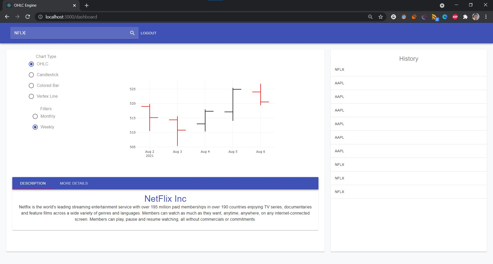

# SVNIT-Team1-

<h1 align="center">OHLC Web Application</h1>

<div align="center">

 We have used [Node](https://nodejs.org/en/about/) and [Express](https://expressjs.com/) for backend and [React](https://reactjs.org/) for frontend

</div>

## Table of Contents

1. [Introduction](#Introduction)
2. [Features](#Features)
3. [Prerequisites](#Prerequirites)
4. [Installation](#Installation)
5. [Demonstration](#Demonstration)
6. [Design Criteria](#DesignCriteria)
7. [Methods(Backend)](#Methods(Backend))
8. [Tools](#Tools)

## Introduction

#### This web application can be extensively put to use for clients who want to take well learned decisions before investing their money in a stock. It is supported by a multi-module scalable back-end engine which will be responsible for taking certain data as input and process the data to showcase the raw data in desired format. It helps users to visualize the stock prices of a company using five different types of plots which include the likes of OHLC and Candelstick graphs.


## Features

### Frontend

- **_Search Bar_** - This feature enables the user to search for different stock prices of the listed organizations. 
 
- **_History_** - The user is also able to view his/her history for the session. 

- **_Charts_** - The search result includes the display of charts for visualizing stock performance on Weekly and Monthly basis as per the user's request.

- **_Description_**- This section is further devided into two parts. The first part consists of basic description about the selected organization, and the second part mainly highlights the key features like open, high, low, close and volume tags of the stock under consideration. 

### Backend

- **_Scalablibility_** - The website is highly scalable to cope with the increase in workload when adding resources (usually hardware).

- **_Secure Authentication_** - Usage of Hashed password using passport.js

## Prerequisites

- Node (npm)


## Instructions to setup and run the solution

To get a copy of the website running on your local system follow these steps :

1.  First clone the Repository.

    ```git clone Link of the repo comes here```

2.  Move to the directory and install all the dependencies.
    
    ```Steps to be followed at Server Side```  
    - cd repo_name  
    - cd server  
    - npm install  
    - npm start  

    
    ```Steps to be followed at Client Side```  
    - cd repo_name  
    - cd client  
    - npm install  
    - npm start  

3.  To connect with MongoDB Database we need to create a database MongoDB Cluster
    - To create MongoDB cluster follow the steps given <a href="https://docs.atlas.mongodb.com/getting-started/?tck=docs_driver_nodejs">here</a>
    - Create .env file in server folder add the following code  
       ```SECRET=[Enter secret key for session]```  
       ```DBPASSWORD=[Enter your database password]```  
       ```USERNAME=[Database Username]```

## Demonstration

- Dashboard



## Design Criteria

- We have used Material UI for designing the frontend of our application

## Methods (Backend)

1. We have created a method to read .json files for fetching the list of registered companies.
2. Further the backend responds to the API call and addresses the query generated by the user. 
3. The logic is designed to output the stock prices for the selected organization as per the request of the user (Weekly/Monthly).

## Tools-Used

- <a href="https://nodejs.org/">Node</a> - Node.js is an open-source, cross-platform, JavaScript runtime environment that executes JavaScript code outside of a browser.
- <a href="https://expressjs.com/">Express</a> - Express is a minimal and flexible Node.js web application framework that provides a robust set of features for web and mobile applications.
- <a href="https://reactjs.org/">React</a> - React makes it painless to create interactive UIs. Design simple views for each state in your application, and React will efficiently update and render just the right components when your data changes.
- <a href="https://www.mongodb.com/developer-tools">MongoDB</a> - MongoDB Developer Tools provide the easiest way for you to connect and work with your MongoDB data from an interface that you are most comfortable and familiar with.
- <a href="http://www.passportjs.org/">Passport</a> - Passport is authentication middleware for Node.js. Extremely flexible and modular, Passport can be unobtrusively dropped in to any Express-based web application. A comprehensive set of strategies support authentication using a username and password
